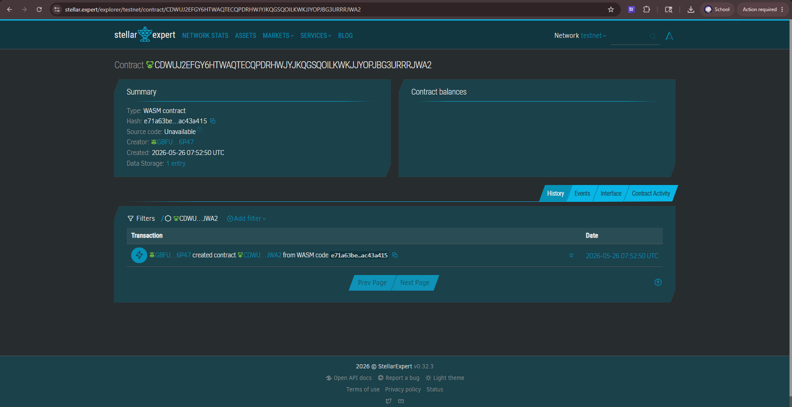

# Anti Crocodile


Transparent disaster relief fund disbursement using Stellar Soroban.

---

## Problem
Local treasurers in Pampanga face corruption risks when releasing relief funds, leaving families without aid for weeks.

## Solution
Funds are locked in a Soroban contract and can only be released to pre‑approved recipients, with all transfers visible on‑chain.

## Contract ID
CDWUJ2EFGY6HTWAQTECQPDRHWJYJKQGSQOILKWKJJYOPJBG3URRRJWA2

## Contract Link
https://stellar.expert/explorer/testnet/contract/CDWUJ2EFGY6HTWAQTECQPDRHWJYJKQGSQOILKWKJJYOPJBG3URRRJWA2



---

## Project Timeline
- **Day 1–2**: Set up Rust + Soroban CLI, scaffold contract.
- **Day 3–4**: Implement core escrow logic and recipient list.
- **Day 5**: Write and run unit tests.
- **Day 6**: Build `.wasm` and deploy to Stellar testnet.
- **Day 7**: Demo MVP transaction flow (deposit → release → public audit).

---

## Stellar Features Used
- USDC transfers  
- Soroban smart contracts  
- Clawback / Compliance  
- Transparency via ledger  

---

## Vision and Purpose
End “crocodile” corruption by ensuring disaster relief funds reach citizens directly.  
This project demonstrates how Stellar can enforce accountability in government disbursements.

---

## Prerequisites
- Rust (via [rustup.rs](https://rustup.rs))  
- Soroban CLI v0.9+  
- Wasm target installed:  
  ```bash
  rustup target add wasm32-unknown-unknown
